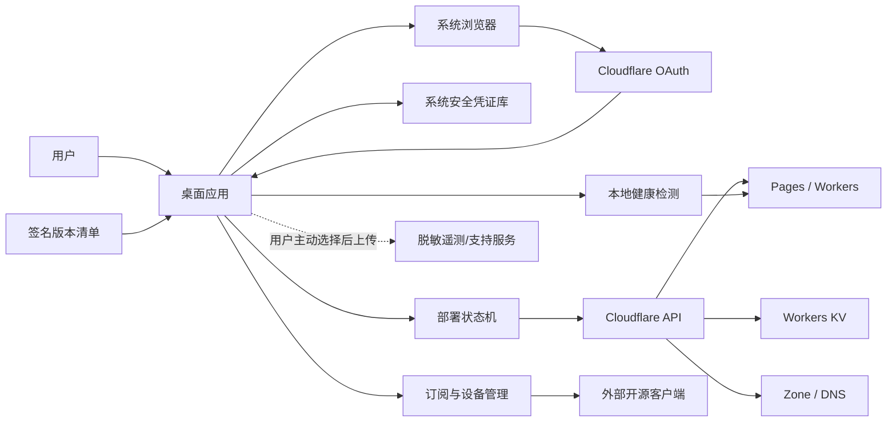
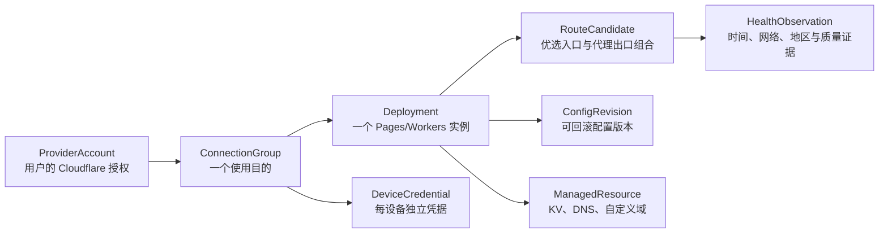

# 自建网络连接自动化助手：完整产品与技术方案

> 文档版本：v1.1（已纳入五套现网实例的只读审查）
> 日期：2026-07-26
> 暂定产品代号：Glide
> 目标平台：macOS、Windows

## 1. 执行摘要

这个项目不应被定义成“把一个视频教程做成自动点击器”，而应定义成：

**一个本地优先、用户自持账号与资源、可审计、可回滚的个人网络连接部署和管理助手。**

用户真正需要的不是“部署完成”本身，而是以下结果：

1. 不理解 DNS、Cloudflare Pages、KV、协议参数，也能完成配置。
2. 账号、授权、密钥和订阅始终属于用户，产品方不能查看用户流量。
3. 软件能判断连接是否真的可用，而不是只显示“部署成功”。
4. 线路失效时能解释原因、修复或回滚。
5. 地区切换、订阅复制、二维码和客户端导入足够简单。
6. 软件安装包、更新包、第三方客户端链接和部署源码均可验证来源。

首个版本建议做成“部署器 + 订阅管理器 + 诊断器”，不要立即内置代理核心。这样可以显著降低 macOS Network Extension、Windows 网络驱动、系统权限、协议实现和开源许可证带来的复杂度。内置连接能力应在产品验证和安全审计完成后作为第二阶段评估。

对五套现网实例的只读审查进一步确认：当前系统更接近“同一种部署的五条候选线路”，还不能视为五个已经验证的独立国家节点。五套实例共享同一个节点 UUID 和路径，且当前检测环境中的四类出口探测均显示日本。产品必须先解决凭据隔离、真实出口验证、重复线路识别和配置版本管理，再做自动选国家和稳定性宣传。

本项目最大的前置风险不是 UI，而是：

- 中国大陆面向公众提供相关服务的许可和合规边界；
- Cloudflare 免费资源是否允许目标用途以及规则变化；
- 免费域名服务的稳定性、API 能力和服务条款；
- 中国大陆到 Cloudflare 全球网络的实际可达性；
- `edgetunnel` 及第三方客户端的供应链和开源许可证；
- “地区选择”是否能真实控制出口地区，而非仅改变入口或显示 IP；
- 免费方案是否能够兑现“永久、稳定、无限流量”等承诺。

因此，产品可以承诺“自动部署、自动检测、自动修复和透明展示状态”，但不能在没有长期实测和正式许可依据时承诺“永久免费、永久可用、大陆必然直连、固定国家出口、无限流量”。

## 2. 视频方案复盘

参考视频：[2026 最强 Cloudflare 免费VPN自建](https://www.youtube.com/watch?v=chcFg878840)

视频的实际流程为：

1. 注册免费域名服务账号并获取一个免费域名。
2. 注册或登录 Cloudflare。
3. 把域名的名称服务器切换到 Cloudflare。
4. 创建 Workers KV 命名空间。
5. 创建 Cloudflare Pages 项目并上传开源项目。
6. 配置 `ADMIN` 环境变量和 `KV` 绑定。
7. 配置自定义域与 CNAME。
8. 再次部署，进入管理页。
9. 生成 VLESS/Trojan 等订阅地址及二维码。
10. 导入 v2rayN 等客户端。
11. 设置优选 IP、数量、端口、代理 IP 和地区偏好。

对应的开源项目为 [`cmliu/edgetunnel`](https://github.com/cmliu/edgetunnel)，许可证是 GPL-2.0。若复制、修改、再分发其代码，必须履行相应的源码开放、版权告知和许可证义务。桌面应用最好只把它作为独立的、版本锁定的部署载荷，不直接把其代码并入闭源桌面程序；正式商业化前仍需由开源许可证律师确认边界。

视频方案适合技术用户验证概念，但不能直接作为商业产品架构，原因包括：

- 手工流程不是幂等的，重复执行容易留下重复 DNS、Pages 项目或 KV。
- 依赖免费域名、Cloudflare 控制台布局和第三方项目，任一变化都会中断流程。
- 视频中的简单管理员密码示例不适合真实产品。
- “部署成功”不等于 DNS 已生效、证书已签发或数据面可用。
- 订阅链接本质上是访问凭证，泄露二维码等同泄露节点。
- 优选 IP 的一次测速不能代表晚高峰、跨运营商和长期稳定性。
- Cloudflare Anycast 入口、Worker 执行位置和目标网站观察到的出口地区并不一定相同。

### 2.1 五套现网实例只读审查

审查日期为 2026-07-26。审查范围包括香港、日本、新加坡、台湾和美国五个标签的管理后台。全过程仅登录、读取页面状态和检查非破坏性交互；未点击保存、重置、删除，也未修改任何线上配置。本文不记录管理密码、完整域名、节点 UUID、路径、订阅 Token、完整 IP 或代理地址。

#### 配置基线

| 项目 | 现场结果 | 产品含义 |
|---|---|---|
| 后台版本 | 五套均为 `v2.1.20260417` | 可以先做单一版本适配，但必须保存版本和兼容性矩阵 |
| 线路标签 | 香港、日本、新加坡、台湾、美国 | 标签只能表示用户意图，不能充当出口证明 |
| 优选配置 | 五套均为自定义模式，每套 10 条优选项 | 需要统一导入、去重、测速和来源追踪 |
| 节点数量 | 随机数量均为 16，端口为随机/全部 | “订阅内节点数”不等于独立出口数 |
| 协议基线 | VLESS + WebSocket；Chrome 指纹；启用 0-RTT、UDP、TLS 1.3 | 产品应提供经过审计的安全预设，不把原始参数直接暴露给普通用户 |
| 订阅输出 | 单节点、自适应、Base64、Clash、sing-box 均已生成 | 可以迁移现有能力，但必须增加每设备凭据、撤销和泄露处置 |
| 客户端入口 | 检测到 v2rayN 与 v2rayNG 的 GitHub Release 链接 | Windows/Android 有入口，macOS 缺少完整路径，且仅放 GitHub 链接无法保证大陆可下载 |
| 客户端存储 | 本次登录后未检测到 Local Storage、Session Storage 或可见 Cookie | 是积极信号，但不能替代服务端会话、传输和源码审计 |

#### 关键发现

1. **地区标签与现场探测不一致。** 五套后台的“国内、国外、Cloudflare、墙外”四类网络卡片在本次受控浏览器环境中均显示 `JP`。这不等于已经证明五条线路的最终物理出口都在日本，因为检测可能受到检查设备、路由路径和数据源影响；但它足以证明“配置名称是香港/美国”不能作为真实出口结论。
2. **节点身份没有隔离。** 五套实例的节点 UUID 完全相同，节点路径也完全相同；只有基于各自域名生成的订阅地址不同。任一共享节点凭据泄露都会扩大到全部五套实例。
3. **管理入口共用一个密码。** 这会把单点泄露扩大为五套后台同时失守。正式产品必须按实例或按账户生成独立高熵管理凭据，并提供轮换和紧急吊销。
4. **存在密码管理器误填风险。** 第一套后台登录后，浏览器把登录密码自动填入了隐藏的 Cloudflare Global API Key 字段。该字段及 Cloudflare API Token 字段没有 `autocomplete` 约束，也不属于语义清晰的独立表单。本次没有保存，因此未写入线上配置；但用户随后编辑并保存其他设置时，可能把误填内容一并提交。
5. **“小白模式”仍然过于技术化。** 切换后虽然高级区域被折叠，但首屏仍展示完整节点链接、订阅 Token、优选 IP 列表、“在线优选”和订阅接口。它减少了展开项，却没有把普通用户的任务简化成“选择地区—验证—连接”。
6. **Cloudflare 凭据面过宽。** 现有后台同时暴露邮箱、Global API Key、API Token 等配置入口。新产品不得要求 Global API Key；应使用系统浏览器中的 OAuth + PKCE 和最小权限。
7. **订阅自动探测受审查环境限制。** 管理页已经生成全部订阅格式，但受控浏览器拦截了带自定义 Token 的订阅 URL，因此本次没有把“页面已生成”误写成“接口已端到端验证”。该项需要在用户本机诊断器和真实客户端中复测。

### 2.2 立即整改建议

在继续扩展功能前，建议按以下顺序处理现网：

1. 备份五套实例的非敏感配置摘要和资源 ID，建立可回滚点。
2. 为五套管理入口生成互不相同的随机密码，并保存在 Glide 专属本机加密凭据目录。
3. 为每套实例轮换独立 UUID、路径和订阅鉴权 Token；旧凭据保留短暂迁移窗口后撤销。
4. 清空或禁用 Global API Key 兼容路径，改用最小权限 API Token；新产品上线后迁移到 OAuth。
5. 从中国移动、电信、联通的真实终端分别执行出口地区、TLS、WebSocket、会话存活和吞吐验证。
6. 将五套实例先标记为“地区待验证”，只有两个独立数据源一致时才显示“已验证国家/地区”。

这些动作会使现有客户端订阅失效或需要重新导入，因此应由迁移向导按“预览变更—生成新凭据—验证新订阅—切换客户端—撤销旧凭据”的顺序执行，不能直接批量覆盖。

## 3. 第一性原理：重新定义问题

### 3.1 用户任务

核心 Jobs-to-be-Done：

> 当我需要一个只属于自己的安全网络连接时，我希望软件替我完成复杂配置、验证可用性并持续维护，让我不必理解网络术语，也不必把账号密码交给第三方。

### 3.2 产品必须守住的边界

产品方不应：

- 代用户注册账号、绕过验证码或代收 OTP；
- 索取 Cloudflare 全局 API Key、邮箱密码或免费域名账号密码；
- 在中心服务器保存用户订阅地址、管理员密码或访问令牌；
- 经营公共节点池或把多个陌生用户导向同一连接资源；
- 宣传无法验证的“永久免费”“永不封锁”“100% 大陆可用”；
- 自动执行来源未知的脚本或上传未锁定版本的代码；
- 未经确认替用户购买资源、升级套餐或删除云端资源。

产品方应：

- 使用系统浏览器完成登录和授权；
- 采用最小权限 OAuth；
- 在执行前展示“将创建、修改和删除什么”；
- 支持重试、恢复、回滚、备份和彻底销毁；
- 把“估算地区”和“已验证出口地区”明确区分；
- 把不可控的供应商状态透明展示给用户。

### 3.3 产品定位

推荐定位：

**个人网络连接基础设施的本地自动化管理器。**

不建议定位：

**面向中国大陆公众的一键翻墙服务。**

前者的资源、账号和流量控制权属于用户；后者容易演变成公共电信或跨境联网服务，法律、运营和平台责任完全不同。

## 4. 合规和商业可行性闸门

### 4.1 中国大陆合规

公开法规和工信部答复显示，国际联网信道、跨境经营、IP-VPN 经营和企业专线使用存在明确监管要求。工信部公开答复中建议有跨境办公需求的企业向依法设置国际通信出入口局的基础电信运营商租用专线等服务。

在明确商业化或对中国大陆公众分发前，必须取得熟悉电信、网络安全、数据跨境和软件分发的中国律师书面意见。律师需要明确：

- 仅提供本地部署工具是否构成相关电信业务；
- 是否可以在中国大陆公开宣传、收费和提供技术支持；
- 产品网站、更新服务、遥测和账号体系是否需要 ICP、增值电信许可或其他备案；
- 是否可以提供节点选择、自动线路调度或订阅分发；
- 用户数据、诊断日志和跨境遥测如何合规；
- 是否需要限制地区、用户类型、用途或功能。

合规材料：

- [中华人民共和国计算机信息网络国际联网管理暂行规定实施办法](https://hbca.miit.gov.cn/xxgk/zcwj/flfg/art/2020/art_b118b9e4e97d4a8e9e6af358c78ac4dc.html)
- [工信部关于外贸企业申请 VPN 的公开答复](https://bzxx.miit.gov.cn/bzxx/reply/detail?appellateId=8a8283846da73d1f016da9b7af1e00a2&id=8a8283846da73d1f016da9b7af1e00a2)
- [清理规范互联网网络接入服务市场的通知](https://www.cac.gov.cn/2017-01/23/c_1120366809.htm)

### 4.2 Cloudflare 可行性

Cloudflare 免费 Workers/Pages Functions 当前存在每日请求、CPU 时间、子请求和项目数量等限制。免费额度和规则会变化，因此必须在 UI 中显示当前套餐、配额和官方更新时间，不能写死“无限”。

Cloudflare 官方文档也明确指出，穿越中国网络边界的流量存在高延迟和可靠性问题；Cloudflare China Network 是 Enterprise 的单独订阅，需要 ICP 和内容审核。免费 Cloudflare 全球资源不能等同于中国大陆境内部署。

关键材料：

- [Cloudflare Workers limits](https://developers.cloudflare.com/workers/platform/limits/)
- [Cloudflare Pages Functions pricing](https://developers.cloudflare.com/pages/functions/pricing/)
- [Cloudflare China Network overview](https://developers.cloudflare.com/china-network/)
- [Cloudflare China Network onboarding](https://developers.cloudflare.com/china-network/get-started/)

正式开发前必须向 Cloudflare 获取目标使用方式的书面确认，至少确认：

- 是否允许以该模式承载个人网络隧道流量；
- 免费和付费套餐各自的限制；
- 是否允许产品通过 OAuth 代表用户自动部署；
- 是否允许大规模引导用户创建相似项目；
- 滥用、暂停、限流、封禁和申诉机制。

### 4.3 Go / No-Go 条件

满足以下条件才进入公开测试：

1. 获得目标市场的书面法律意见。
2. 获得 Cloudflare 对目标用途和自动化方式的确认。
3. Cloudflare OAuth 能以最小权限完成全部所需操作。
4. 对固定版本的部署源码完成许可证审查和独立安全审计，无未修复高危问题。
5. 在中国移动、中国电信、中国联通的真实网络上完成至少 30 天连续测试。
6. 安装、更新、帮助中心和客户端下载路径不依赖先连接其他 VPN。
7. macOS 完成 Developer ID 签名与公证；Windows 完成可信代码签名。
8. 有清晰的停服、供应商变更、密钥泄露和用户资源销毁流程。

任何一项不满足时，不能宣传“大陆稳定直连”。如果 Cloudflare 路径无法通过，产品应转向合规的“用户自有 VPS / 企业专线 / 获许可服务商”适配器，而不是继续强化不可控的免费路径。

## 5. 目标用户和使用场景

### 5.1 首批目标用户

优先：

- 有基本账号注册能力，但不理解 DNS、KV、Pages 的个人用户；
- 海外学习、跨境办公或访问自有海外资源的用户；
- 需要自持资源和订阅、不愿把流量交给陌生公共节点的用户；
- 愿意接受“资源由第三方供应商提供，稳定性不是软件单方面可控”的用户。

暂不优先：

- 需要企业 SLA、团队权限、审计和合规专线的组织；
- 希望无限分享给陌生人的节点运营者；
- 希望软件代注册、代实名、代支付或代持账户的用户；
- 希望对抗强主动识别和封锁、但不接受任何成本或风险的用户。

### 5.2 核心用户旅程

1. 安装并打开软件。
2. 阅读简短的隐私、用途和供应商说明。
3. 软件检查网络、系统时间、DNS、证书和可访问的授权入口。
4. 用户选择“创建新连接”或“导入已有部署”；导入只在本机读取并先生成审查报告。
5. 创建新连接时，用户在系统浏览器注册并登录 Cloudflare。
6. 用户通过 Cloudflare OAuth 授权指定账号和资源范围。
7. 用户选择：
   - 自有域名，推荐；
   - 已接入 Cloudflare 的域名；
   - 第三方免费子域，标记为实验性；
   - 暂不绑定域名，若目标部署方式允许。
8. 软件展示将创建或接管的资源、权限、凭据轮换和客户端影响。
9. 软件自动创建或导入 KV、Pages 项目、环境变量、绑定和 DNS。
10. 软件等待 DNS 与证书状态，实时解释进度。
11. 软件从用户本机完成端到端验证。
12. 软件生成独立设备订阅、复制链接和二维码。
13. 软件检测已安装客户端并指导一键导入；未安装时打开官方签名下载来源。
14. 首页显示连接健康度、地区验证结果和下次检查时间。
15. 失效时执行诊断，提出明确修复方案；破坏性修复前再次确认。

## 6. 产品信息架构

### 6.1 侧边栏

1. **概览**：当前状态、主要操作、健康度、地区偏好。
2. **设置向导**：账号授权、域名、部署和验证。
3. **我的连接**：新建或导入部署、资源状态、版本和配置修订。
4. **线路**：自动选择、地区偏好、质量历史。
5. **订阅与设备**：设备订阅、二维码、轮换和撤销。
6. **客户端**：安装检测、官方下载和导入指导。
7. **诊断**：网络测试、修复、日志导出。
8. **设置**：隐私、更新、外观、语言、危险操作。

### 6.2 首页草图

```text
┌─────────────────────────────────────────────────────────────┐
│  Glide                                           ● 已就绪   │
├───────────────┬─────────────────────────────────────────────┤
│  概览         │  你的连接                                   │
│  设置向导     │  ┌───────────────────────────────────────┐  │
│  我的连接     │  │  健康度 92 · 状态良好                │  │
│  线路         │  │  自动模式 · 已验证地区：新加坡       │  │
│  订阅与设备   │  │                                       │  │
│  客户端       │  │  [打开客户端]      [运行快速检查]     │  │
│  诊断         │  └───────────────────────────────────────┘  │
│               │                                             │
│  设置         │  地区偏好                                   │
│               │  [自动最快] [日本] [新加坡] [美国] [更多]   │
│               │                                             │
│               │  最近 24 小时                               │
│               │  成功率 98.7% · 中位延迟 86 ms · 切换 1 次 │
└───────────────┴─────────────────────────────────────────────┘
```

### 6.3 Apple 风格原则

“像 Apple”应理解为体验原则，不是复制 Apple 资产：

- 视觉层级少、留白充足、主要操作唯一。
- 使用半透明材质、柔和阴影和有限的强调色。
- 状态用文字、图标和颜色共同表达，不能只靠颜色。
- 技术名词默认折叠，“高级信息”按需展开。
- 动画用于解释状态变化，持续时间约 160–240 ms，并支持减少动态效果。
- macOS 使用系统字体；Windows 使用 Segoe UI Variable。
- macOS 可使用符合许可的系统符号；Windows 使用独立许可的图标集，不直接搬用 SF Symbols。
- 支持浅色、深色、高对比度、键盘操作和屏幕阅读器。
- 最低目标为 WCAG 2.1 AA：正文对比度至少 4.5:1，控件至少 3:1。

Apple 的侧边栏设计原则可参考：[Human Interface Guidelines — Sidebars](https://developer.apple.com/design/human-interface-guidelines/sidebars)。

### 6.4 关键文案

不要显示：

- “正在执行 API POST /accounts/...”
- “证书错误 525”
- “优选 IP 数量”

首层显示：

- “正在创建你的连接”
- “域名已经更新，正在等待安全证书”
- “当前线路不稳定，正在切换到备用线路”

展开“技术详情”后再显示资源 ID、错误码、原始日志和帮助链接。

## 7. 功能需求与优先级

### 7.1 Must Have：MVP

| 编号 | 需求 | 验收标准 |
|---|---|---|
| FR-01 | Cloudflare OAuth 授权 | 不要求用户粘贴全局 API Key；可以在 Cloudflare 页面撤销授权 |
| FR-02 | 部署前计划 | 明确列出将创建或修改的 KV、Pages、域名和 DNS |
| FR-03 | 幂等部署 | 重复执行不会创建重复资源，意外退出后可以继续 |
| FR-04 | 安全凭证存储 | Glide 专属目录中的加密凭据数据库；普通工作区数据库只存引用，不请求电脑密码 |
| FR-05 | DNS 与证书检测 | 轮询权威 DNS、Cloudflare 状态和 TLS 证书，超时后给出可行动提示 |
| FR-06 | 端到端验证 | 从用户设备验证 DNS、TCP/TLS、WebSocket/应用协议和基础出口信息 |
| FR-07 | 订阅管理 | 每台设备独立订阅，支持复制、二维码、轮换和撤销 |
| FR-08 | 客户端中心 | 识别系统和架构，展示官方来源、许可证、版本、校验状态 |
| FR-09 | 诊断与修复 | 能区分账号、授权、域名、DNS、证书、配额、部署、网络和客户端问题 |
| FR-10 | 资源销毁 | 展示影响范围，二次确认后删除由本软件创建的资源 |
| FR-11 | 本地日志 | 默认不上传；用户可检查、脱敏并主动导出 |
| FR-12 | 更新安全 | 软件更新必须签名，签名错误时拒绝安装 |
| FR-13 | 导入现有部署 | 只读扫描版本、资源和配置；先出风险报告，再由用户选择接管范围 |
| FR-14 | 凭据隔离 | 检测跨实例重复 UUID/路径/Token；新建时按实例和设备生成独立凭据 |
| FR-15 | 保存防误操作 | 显示字段级变更 diff；浏览器误填不产生脏状态；敏感字段需显式编辑后才提交 |
| FR-16 | 地区证据 | 标签、预期地区、探测地区分别存储；至少两个独立数据源一致才标为“已验证” |

### 7.2 Should Have：公开测试版

- 自动线路健康评分和有滞回的故障切换。
- 地区“偏好”与实际出口地区验证。
- 中国三大运营商的经验数据包，但不把中心数据当作用户本机结论。
- 部署源码版本锁定、变更说明和一键升级/回滚。
- 多个 Cloudflare 账号和多个部署实例。
- 连接组管理：把同一用途的多个实例作为候选线路去重、排序和故障切换。
- 免费方案配额提醒和供应商状态页。
- 代理客户端的订阅刷新指导或官方接口集成。
- 一键生成脱敏诊断包。

### 7.3 Could Have：后续版本

- 合规 VPS 供应商适配器。
- 用户自有服务器的一键 WireGuard/Outline/Amnezia 路径。
- 内置连接核心。
- 按应用分流、Kill Switch、系统代理管理。
- 家庭设备共享和独立设备权限。
- 企业版团队权限、审计和合规网络适配。

### 7.4 Won’t Have：首版明确不做

- 自动绕过 CAPTCHA、验证码或实名流程。
- 批量注册第三方免费账号。
- 中心化公共节点池。
- 代收 Cloudflare、域名或 VPS 密码。
- 未经用户确认自动购买、升级或删除第三方资源。
- 承诺特定受限服务一定可访问。
- 为躲避平台风控而自动创建大量账号、域名或项目。

## 8. 推荐系统架构

### 8.1 技术栈

推荐：

- 桌面框架：Tauri 2
- 系统层与自动化引擎：Rust
- UI：React + TypeScript
- 本地数据：SQLite，仅存非敏感元数据
- 密钥：Glide 专属目录中的随机本机密钥；与加密凭据数据库分文件并限制当前用户访问
- 状态管理：明确的部署状态机
- 更新：Tauri signed updater + macOS/Windows 平台签名
- 后端：MVP 尽量不设中心后端；仅保留签名版本清单、帮助中心和可选遥测端点

选择 Tauri 的原因：

- Rust 适合处理凭证、状态机、校验和系统集成。
- WebView 只能通过受控 IPC 访问系统能力，可用 capabilities 缩小权限面。
- 安装包相对轻量，便于双平台交付。
- 更新器强制校验更新签名。

参考：

- [Tauri security](https://v2.tauri.app/security/)
- [Tauri updater](https://v2.tauri.app/plugin/updater/)

如果预算充足且追求极致原生体验，可分别使用 SwiftUI 和 WinUI 3，但会显著增加开发、测试和长期维护成本。首版不推荐双原生实现。

### 8.2 逻辑架构



核心原则：

- 控制平面在用户本机。
- 数据流量不经过产品公司的服务器。
- OAuth 令牌和订阅密钥不进入产品公司的云端。
- 云端仅提供签名元数据、帮助文档和可选的脱敏遥测。

### 8.3 部署状态机

```text
DRAFT
  → AUTHORIZED
  → DOMAIN_PENDING
  → DOMAIN_READY
  → PROVISIONING
  → DEPLOYED
  → VERIFYING
  → ACTIVE

任意阶段 → DEGRADED → DIAGNOSING → REPAIRING → VERIFYING
任意可回滚阶段 → ROLLING_BACK
用户确认 → DESTROYING → DESTROYED
```

每个步骤必须有：

- 输入条件；
- 期望状态；
- 幂等键；
- 超时；
- 可重试错误；
- 不可重试错误；
- 补偿动作；
- 用户可见说明；
- 本地审计事件。

例如，“创建 KV”不以 HTTP 200 作为成功标准，而以“存在由本应用标签管理、名称和预期匹配的 KV 命名空间”为成功标准。

### 8.4 Cloudflare 授权

Cloudflare 现在支持第三方 OAuth 应用。使用 Authorization Code + PKCE，通过系统浏览器授权，不在应用内 WebView 中收集账号密码。

建议分阶段最小权限：

- 账号与成员只读；
- Zone 读取/写入；
- DNS 读取/写入；
- Pages 读取/写入；
- Workers KV 读取/写入；
- 如部署方式需要，再申请 Workers Scripts 权限。

OAuth 资料：

- [Cloudflare OAuth Applications](https://developers.cloudflare.com/fundamentals/oauth/)
- [Authorizing an application](https://developers.cloudflare.com/fundamentals/oauth/authorizing-an-application/)
- [Cloudflare API token permissions](https://developers.cloudflare.com/fundamentals/api/reference/permissions/)

令牌策略：

- access token 只保存在系统凭证库；
- refresh token 若存在，也只保存在系统凭证库；
- 支持一键断开并撤销授权；
- 授权范围在 UI 中用自然语言解释；
- 不申请 Billing、全账号管理或创建其他 API Token 的权限；
- 不接受 Global API Key 作为“兼容模式”。

### 8.5 域名策略

优先级：

1. 用户已有且已接入 Cloudflare 的域名；
2. 用户自有域名，由软件指导切换名称服务器；
3. 有正式 API、稳定条款和可验证所有权的合作域名供应商；
4. 免费子域，只作为实验功能。

免费域名不能成为 MVP 的唯一入口，因为：

- 免费策略、根域可用性和注册额度会变化；
- 可能没有 OAuth/API，只能依赖网页操作；
- CAPTCHA、邮件 OTP 和服务条款不能自动绕过；
- 部分子域可能无法作为 Cloudflare 完整 Zone 接入；
- 域名被收回会同时使连接、订阅和证书失效。

每个域名适配器需要统一接口：

```text
checkAvailability
registerOrClaim
getNameservers
setNameservers
verifyDelegation
getRenewalStatus
renew
release
```

没有正式 API 的供应商只能使用“引导模式”，不能用脆弱的鼠标坐标录制或绕过网页保护。

### 8.6 现有部署适配器与领域模型

五套现网实例说明，产品不能把“一个管理网址”直接等同于“一个国家节点”。建议使用以下领域模型：



关键区别：

- `configuredRegion`：用户希望的地区，例如“香港”；
- `observedRegion`：某次探测数据源返回的地区；
- `verifiedRegion`：多个独立探测在有效时间窗内达成一致的地区；
- `deployment`：一套云端资源，不保证独立出口；
- `routeCandidate`：优选入口、代理 IP、端口和传输参数的组合；
- `deviceCredential`：某台设备可单独轮换和撤销的访问凭据。

现有实例导入采用两阶段：

1. **只读发现**：识别后台版本、配置摘要、重复凭据、资源归属、订阅格式和风险，不保存更改。
2. **显式接管**：用户逐项确认凭据轮换、配置修订、健康监控和资源标签；不接管的字段继续只读。

不建议通过模拟管理后台点击来长期维护。应优先使用 Cloudflare 官方 API；对 `edgetunnel` 配置增加版本化的兼容适配器。适配器必须做到：

- 读取未知字段时保留原值，不能因为新应用不认识就覆盖；
- 保存前生成结构化 diff；
- 只有用户显式修改的敏感字段才进入请求；
- 每个变更带预期旧版本号，防止并发覆盖；
- 变更后先验证新版本，失败自动恢复上一修订；
- 记录“用户输入、浏览器自动填充、导入值、系统生成值”的字段来源。

## 9. 自动优化和稳定性设计

### 9.1 不把“延迟最低”当作“最好”

线路评分需要覆盖：

- DNS 成功率；
- TCP/TLS 建连成功率；
- 握手延迟；
- 延迟抖动；
- 会话存活率；
- 丢包或重传；
- 受控小文件吞吐；
- 目标类别可达性；
- 实际出口地区验证；
- 最近失败时间；
- 供应商错误和剩余配额。

示例评分：

```text
healthScore =
  0.30 × connectionSuccess
  + 0.20 × sessionSurvival
  + 0.15 × latencyScore
  + 0.10 × jitterScore
  + 0.10 × throughputScore
  + 0.10 × targetReachability
  + 0.05 × regionConfidence
```

权重必须可通过实测校准，不应把示例公式写死为业务真理。

### 9.2 自动切换规则

- 使用指数移动平均平滑短期波动。
- 单次失败不立即切换。
- 连续失败达到阈值后进入 `DEGRADED`。
- 新线路必须明显优于当前线路并持续一段时间才切换，防止来回抖动。
- 切换失败自动退回上一个已知可用版本。
- 同时维护当前、候选和最后可用三个配置快照。
- 高级用户可以查看原因，普通用户只看到“已切换到更稳定线路”。

### 9.3 地区选择

UI 应使用：

- “地区偏好：新加坡”
- “实际出口：新加坡，已验证”
- “实际出口：未知”

不能仅因为某个优选地址标签为日本，就显示“日本节点”。Cloudflare Anycast 入口和外部服务观察到的出口可能不同。每次切换后需要通过至少两个独立地区数据源交叉验证，结果不一致时显示“估算”。

如果用户需要确定性的国家出口，架构上应使用该国家的合规 VPS、企业网络或供应商明确提供的 egress location，而不是仅依赖 Cloudflare 优选 IP。

结合现网结果，首页的正确表达应类似：

```text
线路名称：香港
地区偏好：香港
当前探测：日本
验证状态：未通过（4 项探测一致为日本，但仍需用户本机复测）
建议操作：重新选择候选线路 / 检查 PROXYIP / 运行三网深度检查
```

线路去重不能只比较域名。若多个实例具有相同 UUID、路径、优选池、代理出口或高度相似的性能指纹，应标记为“可能重复”，避免把同一故障域包装成多个备用节点。

### 9.4 测试策略

- 快速检查：启动、网络切换、系统唤醒后执行，控制在 3–5 秒。
- 标准检查：每 30 分钟或用户主动执行。
- 深度检查：仅用户主动触发，包含更完整吞吐和多目标检查。
- 默认测试受控端点，不自动访问敏感或受限网站。
- 测试流量设上限，避免消耗用户流量和触发平台风控。
- 本地记录最近 7–30 天聚合指标，不保留浏览历史。

## 10. 订阅、二维码和客户端

### 10.1 订阅安全

- 每台设备生成独立的 256-bit 随机凭证。
- 节点认证凭据、管理凭据和订阅鉴权 Token 分离，不能复用同一秘密。
- 服务端只保存凭证哈希或等价的不可逆验证材料。
- 二维码默认模糊，用户点击后短时显示。
- 复制时说明“此链接等同访问凭证”。
- 支持轮换、撤销、到期时间和设备备注。
- 轮换采用“双凭据迁移窗”：先验证新凭据，再在明确期限后撤销旧凭据。
- 导入现有实例时自动检查 UUID、路径和 Token 的跨实例重复，但报告只显示重复组，不回显秘密。
- 订阅链接在日志、错误报告和遥测中必须自动脱敏。
- 剪贴板自动清理只能在“内容仍与本应用写入内容一致”时进行，避免覆盖用户后续复制的内容。

### 10.2 客户端中心

首版不直接托管未知二进制，只提供：

- 官方网站或官方 GitHub Release；
- 当前稳定版本和发布日期；
- 支持的操作系统与 CPU 架构；
- 开源许可证；
- 发布者签名或哈希状态；
- 是否已安装；
- 导入步骤；
- “打开客户端”操作。

候选客户端必须经过独立评估，不因为“免费开源”就自动列入。至少检查：

- 仓库和发布者真实性；
- 最近维护状态；
- 安全公告；
- 二进制签名；
- 自动更新策略；
- GPL/AGPL 等分发义务；
- 是否存在遥测、广告、捆绑软件；
- 是否支持订阅隔离和安全存储。

如果要实现“在中国大陆无需其他 VPN 即可下载”，必须解决分发链路，而不是只放 GitHub 链接：

- 自有应用优先通过 Microsoft Store 和经公证的 macOS DMG 分发；
- 帮助中心和更新清单部署到合法、可达、可监控的基础设施；
- 第三方客户端如需镜像，必须先获得分发授权并验证许可证；
- 镜像文件必须保持原发布者签名，并额外校验 SHA-256；
- 不能用不明网盘或匿名镜像作为默认源。

### 10.3 内置连接能力

第二阶段如果内置代理核心，需要额外完成：

- macOS Network Extension 和系统权限设计；
- Windows 网络过滤、系统代理或 TUN 驱动方案；
- Kill Switch、DNS 泄漏、IPv6、睡眠唤醒和多网卡测试；
- 与 mihomo、sing-box、Xray 等核心的许可证兼容性审查；
- 进程隔离、配置注入防护和崩溃恢复；
- 全量安全审计。

如果产品计划闭源，优先把未修改的开源核心作为独立进程，并取得律师对进程通信和再分发义务的意见。更简单的方案是把整个产品以兼容许可证开源。

## 11. 安全与隐私设计

### 11.1 主要威胁

1. OAuth token 被本地恶意软件窃取。
2. 部署源码或更新服务器被入侵。
3. 管理入口遭暴力破解。
4. 订阅链接或二维码泄露。
5. 免费域名被收回或 DNS 被劫持。
6. 第三方客户端安装包被替换。
7. 自动修复错误删除用户已有资源。
8. 未脱敏日志暴露域名、订阅或账户 ID。
9. 用户把节点分享给陌生人导致滥用和封禁。
10. 供应商配额耗尽、规则变化或账号暂停。
11. 多个实例复用管理密码、UUID 或路径，单点泄露扩散到全部线路。
12. 密码管理器把登录密码误填到 Cloudflare 密钥字段，并在保存其他配置时一并提交。
13. 旧版管理面板与新适配器字段不兼容，保存时覆盖未知配置。

### 11.2 必须实施的控制

- 管理密码由密码学安全随机数生成，不允许 `12345678` 之类弱密码。
- 每个实例和每台设备的凭据必须独立；创建和导入时执行重复检测。
- 管理面板默认关闭公网登录，管理优先通过本地应用和 Cloudflare API。
- 登录表单与云端密钥设置完全分离；正确使用 `autocomplete` 语义，禁止把浏览器自动填充值视为用户修改。
- 不提供 Global API Key 输入；兼容旧实例时只允许只读发现和迁移，不允许静默保存。
- 保存前展示字段级 diff，秘密只显示“新增、轮换、清除、未变化”，不回显原值。
- 管理入口实施速率限制、失败退避、MFA 或一次性本地授权，并配置 CSP、HSTS、`frame-ancestors` 和禁止敏感页面缓存。
- 部署载荷锁定到经过审计的 commit SHA，禁止自动跟随 `main`。
- 生成 SBOM、依赖锁文件和构建来源证明。
- 软件更新、部署载荷、客户端元数据清单分别签名。
- Tauri IPC 采用最小 capabilities；WebView 不直接获得文件系统、Shell 或密钥库通用权限。
- 禁止从远程配置下发任意命令。
- 所有删除动作按“由本应用创建的资源标签 + 资源 ID”双重确认。
- 本地数据库加密敏感字段；真正的秘密只保存在操作系统凭证库。
- 诊断日志分级，默认不包含完整域名、IP、账户 ID 和 URL query。
- 安全事件发生后可远程撤销版本清单，但不能远程控制用户设备。

### 11.3 隐私原则

- 默认零账号体系或仅本地档案。
- 默认关闭遥测。
- 遥测开启时只收集明确列出的聚合数据。
- 用户可在发送前预览诊断包。
- 不记录目标网站、DNS 查询历史或用户流量内容。
- 隐私政策必须说明 Cloudflare、域名服务商和外部客户端是独立第三方。

## 12. 非功能要求

| 类别 | 指标 |
|---|---|
| 部署成功率 | 支持组合下首次或自动重试后 ≥ 95% |
| 首次可用时间 | P50 ≤ 15 分钟；P90 ≤ 30 分钟，不含用户注册等待 |
| 恢复能力 | 进程退出后恢复到最近状态，不重复创建资源 |
| 快速检查 | P95 ≤ 5 秒 |
| 线路切换 | 可控场景下 P95 ≤ 10 秒恢复 |
| 崩溃率 | Crash-free sessions ≥ 99.5% |
| 更新安全 | 100% 更新包通过签名验证 |
| 密钥隐私 | 0 个明文凭证写入日志、SQLite 或遥测 |
| 可访问性 | WCAG 2.1 AA；完整键盘操作 |
| 兼容性 | macOS 最近 3 个主要版本；Windows 10 22H2 与 Windows 11 |
| 可观察性 | 每个部署步骤有本地事件、耗时和结构化错误 |

连接可用率只能作为特定网络和时间窗口内的观测指标，不能把 Cloudflare 免费资源包装成产品方可控制的 SLA。

## 13. 发布、签名和更新

### 13.1 macOS

- 使用 Developer ID Application 签名。
- 使用 Apple 公证服务扫描并公证。
- 对 DMG 或 PKG 完成签名和 stapling。
- 同时测试 Intel 与 Apple Silicon，优先发布 Universal Binary。
- 不请求与 MVP 无关的系统权限。

参考：[Notarizing macOS software before distribution](https://developer.apple.com/documentation/security/notarizing-macos-software-before-distribution)。

### 13.2 Windows

- 使用可信 CA 颁发的代码签名证书签名 EXE/MSI。
- 优先评估 Microsoft Store 的 MSIX 分发。
- 安装器、卸载器、应用二进制和更新器全部签名。
- 在 Windows Smart App Control 与 SmartScreen 环境测试。

参考：

- [Windows code signing options](https://learn.microsoft.com/en-us/windows/apps/package-and-deploy/code-signing-options)
- [Smart App Control](https://learn.microsoft.com/en-us/windows/apps/develop/smart-app-control/overview)

### 13.3 更新策略

- Stable、Beta 两个通道。
- 更新清单通过 HTTPS 获取，安装包再做独立签名验证。
- 支持强制安全更新，但不能静默扩大权限。
- 版本发布附部署载荷变更、权限变化和已知风险。
- 保留最近一个稳定版本的回滚能力。
- 更新服务器不可达时，现有本地功能继续运行。

## 14. 竞品与差异化

| 产品 | 特点 | 本项目可借鉴 | 空白 |
|---|---|---|---|
| Outline Manager | 图形化部署和管理自建服务 | 清晰的管理器/客户端分离 | 主要依赖服务器，不是 Cloudflare 自动化 |
| AmneziaVPN | 输入服务器信息后自动部署多协议 | 自建体验、跨平台、分流 | 仍需要 VPS，产品体验偏技术 |
| Algo VPN | 安全默认值、自动化 WireGuard/IPsec | 可审计、最小化、明确反特性 | 对普通用户仍偏命令行 |
| 商业 VPN | 即开即用、多地区 | 用户期望和连接体验 | 用户不自持基础设施 |
| 视频脚本/面板 | 免费、部署快、社区活跃 | 快速验证需求 | 缺少安全、回滚、合规和持续维护 |

参考：

- [Outline Manager](https://developer.getoutline.org/vpn/getting-started/server-setup-manager/)
- [Amnezia self-hosted VPN](https://amnezia.org/self-hosted)
- [Algo VPN](https://github.com/trailofbits/algo)

真正的差异化不应是“又一个免费 VPN”，而是：

1. 用户自持账号、域名、部署和订阅。
2. 不托管流量和秘密。
3. 把部署、诊断、升级、回滚和销毁做成一个完整生命周期。
4. 用实测健康度替代夸张的速度和永久性宣传。
5. 对供应商限制、地区置信度和风险保持透明。

## 15. 商业模式

建议：

- 免费版：单实例部署、订阅导出、基础诊断。
- Pro：多实例、多设备订阅、历史健康分析、高级修复、VPS 适配器。
- 团队/企业：仅在获得合规资质后提供，包含团队权限、审计和合规网络集成。

不建议：

- 售卖节点；
- 汇集用户流量；
- 代持账户；
- 依赖 VPN 联盟链接作为核心收入；
- 以“解锁某服务”作为付费承诺；
- 用免费 Cloudflare 资源承担付费产品 SLA。

产品收入应来自软件自动化、维护和支持，而不是转售网络流量。

## 16. 开发路线图

### Phase 0：可行性与合规，2–4 周

- 法律意见和 Cloudflare 用途确认。
- 复现视频流程并记录全部 API。
- 为五套现网实例建立脱敏基线，完成凭据轮换和真实出口复测。
- 验证 Cloudflare OAuth + PKCE。
- 评估域名路径和免费域名失败率。
- 锁定 `edgetunnel` 版本并完成许可证、安全初审。
- 建立三大运营商的测试矩阵。
- 输出 Go / No-Go 决策。

### Phase 1：MVP，8–10 周

- Tauri 桌面壳和设计系统。
- Cloudflare OAuth。
- 现有 `edgetunnel` 部署的只读导入、版本识别和风险报告。
- 部署计划、状态机和幂等执行。
- KV、Pages、DNS 与证书自动化。
- 订阅复制、二维码、轮换和撤销。
- 客户端中心和导入指导。
- 本地诊断、日志和资源销毁。
- macOS/Windows 签名发布。

### Phase 2：公开测试，6–8 周

- 线路健康评分。
- 地区验证与偏好。
- 自动修复和回滚。
- 部署载荷升级。
- 脱敏诊断包和可选遥测。
- 30 天跨 ISP 验证。

### Phase 3：扩展，8–12 周

- 用户自有 VPS 适配器。
- Outline/Amnezia/WireGuard 等替代路径。
- 多实例和多设备管理。
- 评估内置连接核心。

### 团队建议

- 1 名产品经理/业务分析；
- 1 名 UX/UI 设计师；
- 2 名 Tauri/Rust/TypeScript 工程师；
- 1 名网络与云自动化工程师；
- 1 名 QA/网络测试工程师；
- 安全工程师和法律顾问按阶段参与。

4–6 人团队约 4–6 个月可达到审慎的公开测试版；单人开发通常需要 6–12 个月，并且安全、网络实测和合规不能省略。

## 17. 测试矩阵

### 17.1 平台

- macOS：Intel、Apple Silicon；最近 3 个主要版本。
- Windows：Windows 10 22H2、Windows 11；x64，后续评估 ARM64。
- 干净安装、升级安装、卸载重装。

### 17.2 网络

- 中国移动、中国电信、中国联通。
- 家庭宽带、手机热点、公司网络、公共 Wi-Fi。
- IPv4、IPv6、双栈。
- DNS 污染、系统代理残留、错误系统时间、证书拦截。
- 网络切换、睡眠唤醒、断网恢复。
- 高峰与非高峰时段。

### 17.3 供应商失败

- OAuth 拒绝、撤销和过期。
- API 429、5xx 和超时。
- Workers/Pages 配额耗尽。
- DNS 未传播。
- 自定义域证书签发失败。
- 免费域名不可注册、被收回或名称服务器不可修改。
- Pages 部署成功但运行报 1101/1102/1027。
- 源项目新版本不兼容。

### 17.4 安全

- 凭证库访问控制。
- 多实例重复 UUID、路径、管理密码和订阅 Token 检测。
- 密码管理器误填、表单脏状态和保存 diff。
- 登录暴力破解、速率限制、MFA/一次性授权。
- 日志脱敏。
- 二维码和剪贴板泄露。
- 恶意订阅内容和配置注入。
- DNS rebinding、SSRF、路径遍历。
- 更新清单和安装包篡改。
- 回滚攻击。
- 权限提升和 IPC 滥用。
- 第三方客户端安装包替换。

## 18. 主要风险清单

| 风险 | 概率 | 影响 | 应对 |
|---|---:|---:|---|
| 中国大陆合规不允许目标商业模式 | 高 | 极高 | Phase 0 书面法律意见；必要时限制市场或转企业合规网络 |
| Cloudflare 不允许或限制该用途 | 中高 | 极高 | 获取书面确认；准备 VPS/许可供应商适配器 |
| 免费资源政策变化 | 高 | 高 | 不承诺永久；远程签名兼容清单；可迁移架构 |
| 大陆网络可达性波动 | 高 | 高 | 多 ISP 长测；透明健康度；不承诺 100% |
| 免费域名失效 | 高 | 高 | 自有域优先；续期提醒；迁移工具 |
| 部署源码存在漏洞 | 中 | 极高 | 固定版本、代码审计、SBOM、可回滚 |
| 订阅泄露导致滥用 | 中 | 高 | 每设备凭证、轮换、撤销、速率限制 |
| 多实例共享凭据导致横向失陷 | 已存在 | 极高 | 立即轮换；导入时重复检测；每实例/设备独立凭据 |
| 地区探测与配置标签冲突 | 已存在 | 高 | 标签与证据分离；双数据源；目标网络复测 |
| 密码误填到云端密钥字段 | 已观察 | 极高 | 表单隔离、正确 autocomplete、显式编辑、保存 diff |
| 第三方客户端供应链风险 | 中 | 极高 | 官方源、签名/哈希验证、许可证审查 |
| 地区标签误导用户 | 高 | 中 | 实际出口验证；置信度展示 |
| 软件被系统拦截 | 中 | 高 | macOS 公证、Windows 签名、商店分发 |
| 支持成本被网络差异放大 | 高 | 高 | 自动诊断、脱敏日志、支持矩阵、明确边界 |

## 19. 产品成功指标

北极星指标：

**完成部署后 7 天内，用户无需人工支持且每天至少一次成功通过健康检查的活跃连接数。**

辅助指标：

- 设置向导完成率；
- 从授权到首次验证成功的 P50/P90 时间；
- 首次部署成功率；
- 自动修复成功率；
- 7 日和 30 日可用率；
- 每百次部署的人工支持请求数；
- 订阅泄露/撤销事件数；
- 安全更新覆盖率；
- 卸载时资源清理完成率；
- 用户对状态解释清晰度的评分。

速度不应作为唯一北极星指标，因为速度容易被短时测试、缓存和网络条件误导。

## 20. 最终建议

### 建议立项，但必须改变原始实现思路

建议保留：

- macOS + Windows；
- Apple 风格的简洁体验；
- 用户只处理注册、登录、授权和必要确认；
- 自动部署、订阅复制、二维码、客户端引导；
- 自动检测、地区偏好和修复；
- 用户自持账号与资源。

建议修改：

- 把“免费永久 VPN”改为“用户自持的网络连接自动化助手”；
- 把 Cloudflare 免费路径定义为一个可替换适配器，而不是整个产品；
- MVP 不内置 VPN 核心；
- 免费域名只做实验路径，自有域名优先；
- 地区选择显示“偏好 + 已验证出口”，不虚构确定性；
- 所有自动化通过 OAuth/API 和状态机完成，不做网页坐标录制；
- 把合规、平台条款、安全审计和真实网络长测作为立项闸门。

### 五套现网实例的产品化处理

不要把它们直接做成首页上的“五国节点”。第一版应把它们导入为一个名为“Cloudflare 连接组”的五条候选线路，并显示：

- 配置标签；
- 凭据是否独立；
- 当前探测地区和置信度；
- 最近 24 小时成功率、延迟和会话存活；
- 是否与其他线路疑似重复；
- 配置版本和最后一次验证时间。

在完成独立凭据轮换和中国三网复测前，默认选项应是“自动（仅在已验证线路中选择）”，五个国家按钮显示“待验证”，不能让 UI 用国旗制造确定性。

### 推荐的 MVP 价值主张

> 注册并授权你的账号，Glide 会安全地创建、验证和维护属于你的个人网络连接。资源和密钥始终由你掌控；任何异常都会被解释，并提供可回滚的修复方案。

这个价值主张真实、可验证，也比“永久免费、不封、无限流量”更容易建立长期信任。
